## Creation of EC2 Instances

Created an EC2 instances each for nexus, sonarqube and jenkins
* Nexus - centos, t2.medium(4gb ram)
* Sonarqube - ubuntu18, t2.medium
* Jenkins - ubuntu20, t2.small

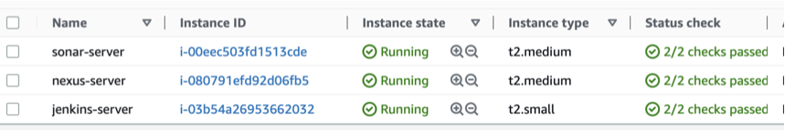

## Setting up Jenkins, Nexus and Sonarqube servers

1. Jenkins

* On the terminal, cd into jenkins server using the public-IP address
* check if ther server is up and running
```
systemctl status jenkins
```

* Open TCP port 8080 to allow incoming traffic from anywhere

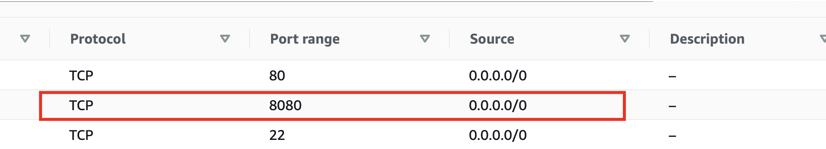

* Check the accessibility of the server on a browser, using public-IP address
`http://<Public-IP-Address>:8080`

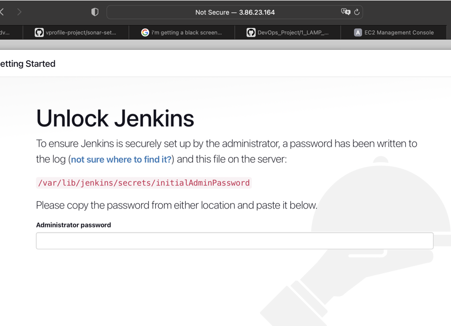

* After succesful accessibility, setup jenkins on the browser, On the server `cat` the password
```
cat /var/lib/jenkins/secrets/InitialPassword
```

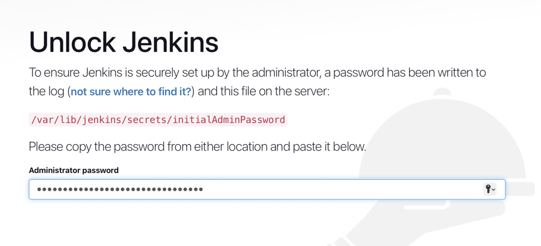

* Install recommended plugins and setup a profile

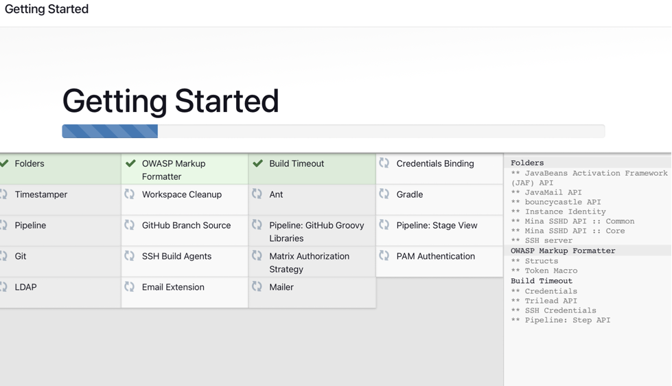

2. Nexus

* On the terminal, ce into nexus to check if the server is up and running

* Open TCP port 8081 to allow inbound traffic from anywhere

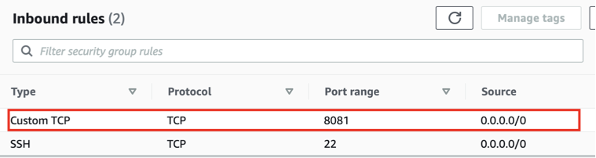

* Access the instance on a browser using public-IP

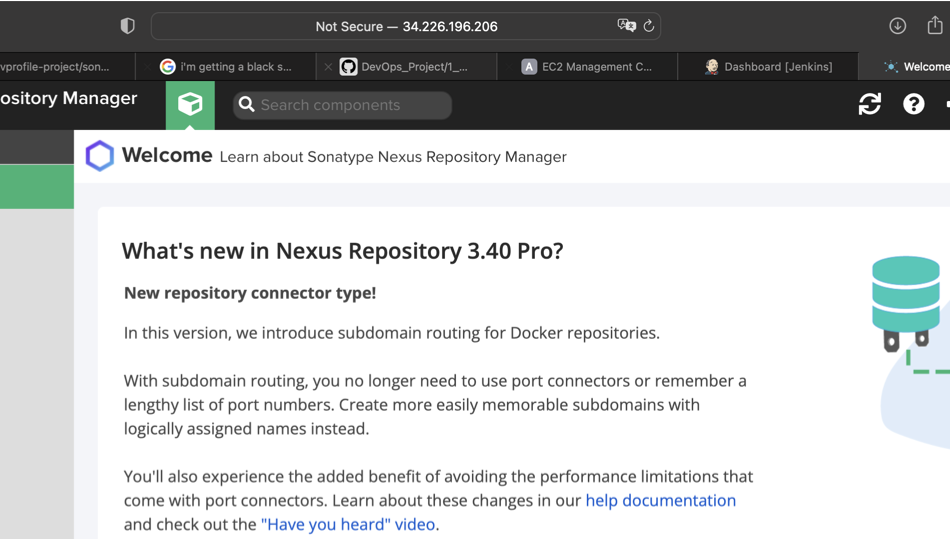

* Sign in using `admin` as username and `cat /opt/nexus/sonatype-work/nexus3/admin.password ` for passwd

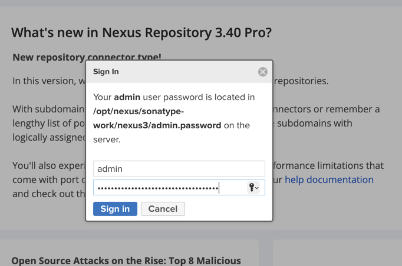

* Set a new password and enable anonymous access

3. Sonarqube

* On the terminal, ce into nexus to check if the server is up and running

* Open TCP port 80 and 9000 to allow inbound traffic from anywhere

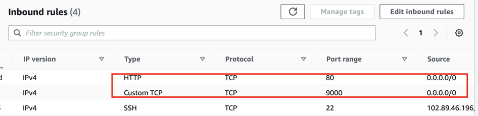

* Sign in using `admin` as username and password

## Plugins for CI on Jenkins

1. Install additional plugins needed for integration

2. On Jenkins Dashboard, click on `Manage Jenkins`

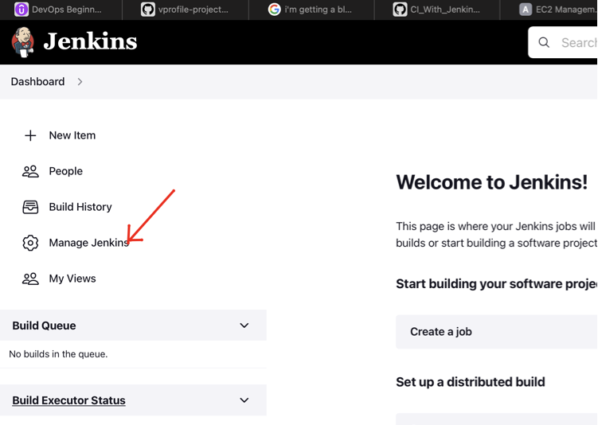

3. Do the following:

* Check `Enable proxy compatibility`, under `Configure Global Security`, and save

* Install these plugins; `Nexus Artifact Uploader`, `Sonarqube Scanner`, `Build Timestamp`, `Pipeline maven integration` and `pipeline utility steps`, under `Manage Plugins`

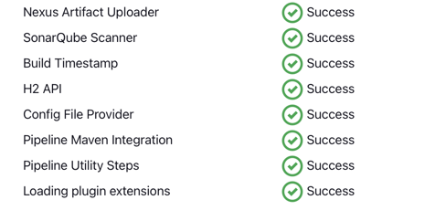

* Add `OracleJDK8` and `Maven3`, under `Global Tool Configuration`

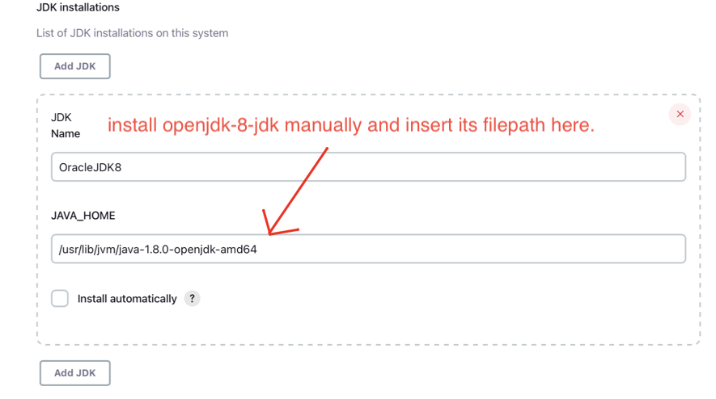

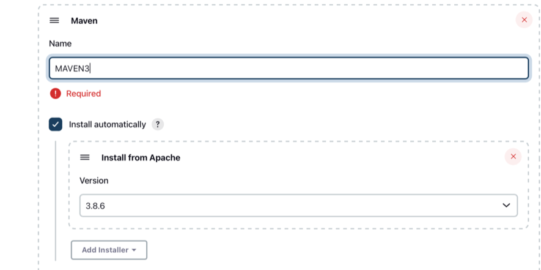

## Build and Test

1. Click on `Create Job` on the Dashboard, enter the build name and  choose `Pipeline`

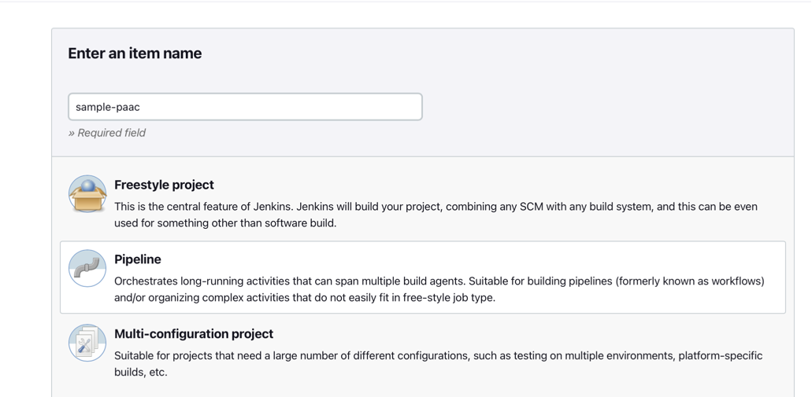

2. On the Configuration page, under pipeline, paste your pipeline script, and save

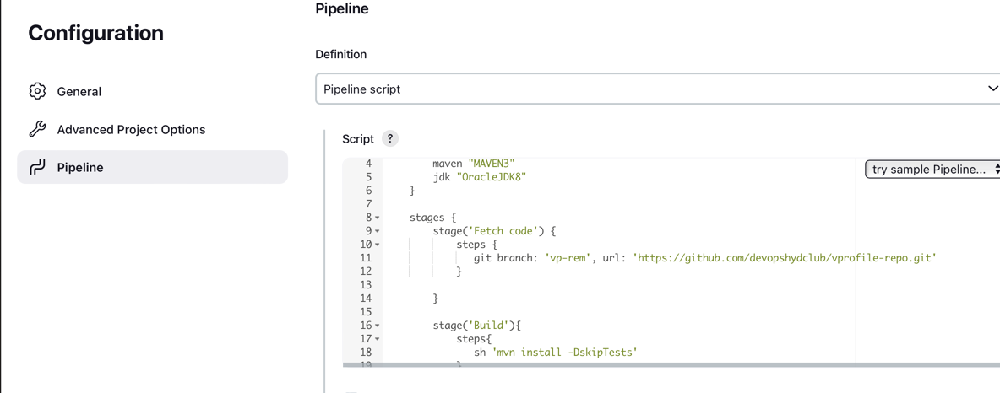

3. Click on `Build Now`

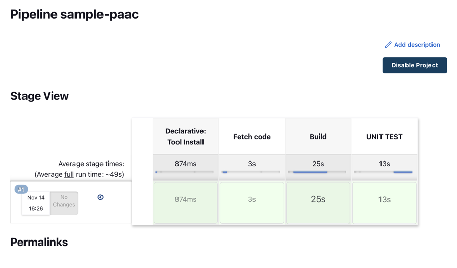

## Code Analysis


